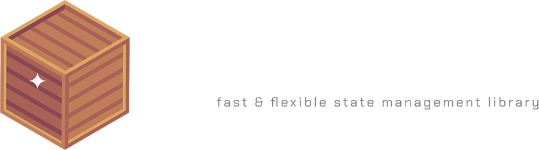

<h1 align="center">
  <a href="https://github.com/Neohertz/crate"></a>
</h1>

<h4 align="center">
<b>
A simple to use, scalable state container built for the <a href="https://roblox-ts.com">roblox-ts</a> ecosystem
</b>
<h4>

<div align="center">

[![Contributors][contributors-shield]][contributors-url]
[![Forks][forks-shield]][forks-url]
[![Stargazers][stars-shield]][stars-url]
[![Issues][issues-shield]][issues-url]
[![Unlicense License][license-shield]][license-url]

</div>

<p align="center">
<b>
  <a href="#about">About</a> •
  <a href="#installation">Installation</a> •
  <a href="#credits">Credits</a> •
  <a href="#changelog">Changelog</a> •
  <a href="https://docs.neohertz.dev/docs/crate/about">Documentation</a>
</b>
</p>

<!-- <br>
<p align="center">
<b>
<a href="https://docs.neohertz.dev/docs/crate/about">Documentation</a>
</b>
</p> -->

# 📦 About

`@rbxts/crate` combines simplicity and quality of life with the ability to perform at scale.

> [!CAUTION]
> This package is still in **early beta**, expect breaking changes

# 💻 Installation

```bash
npm i @rbxts/crate
yarn add @rbxts/crate
pnpm add @rbxts/crate
```

# 💡 Credits

This software uses the following:

- [Icon](https://www.flaticon.com/free-icons/wooden-box)
- Emojis were taken from [here](https://emojipedia.org/)

# ⚒️ Changelog

## v1.0.0

### Added or Changed

- `.get()` has been renamed to `.getState()`

## v0.0.5

### Added or Changed

- Second parameter to copy object passed to `.update()`. [#1](https://github.com/Neohertz/crate/issues/1)

### Fixed

- Issue with equality check on update. [#3](https://github.com/Neohertz/crate/issues/3)

## v0.0.4

### Fixed

- `.get()` type issue with key.

## v0.0.3

### Added or Changed

- Internal state is fully immutable.
- `onUpdate()` callback is no longer invoked if the state doesn't truly change.

### Fixed

- Type errors

### Removed

- `reset()` method.

[contributors-shield]: https://img.shields.io/github/contributors/othneildrew/Best-README-Template.svg?style=for-the-badge
[contributors-url]: https://github.com/Neohertz/crate/graphs/contributors
[forks-shield]: https://img.shields.io/github/forks/othneildrew/Best-README-Template.svg?style=for-the-badge
[forks-url]: https://github.com/Neohertz/crate/network/members
[stars-shield]: https://img.shields.io/github/stars/othneildrew/Best-README-Template.svg?style=for-the-badge
[stars-url]: https://github.com/Neohertz/crate/stargazers
[issues-shield]: https://img.shields.io/github/issues/othneildrew/Best-README-Template.svg?style=for-the-badge
[issues-url]: https://github.com/Neohertz/crate/issues
[license-shield]: https://img.shields.io/github/license/othneildrew/Best-README-Template.svg?style=for-the-badge
[license-url]: https://github.com/Neohertz/crate/blob/master/LICENSE
