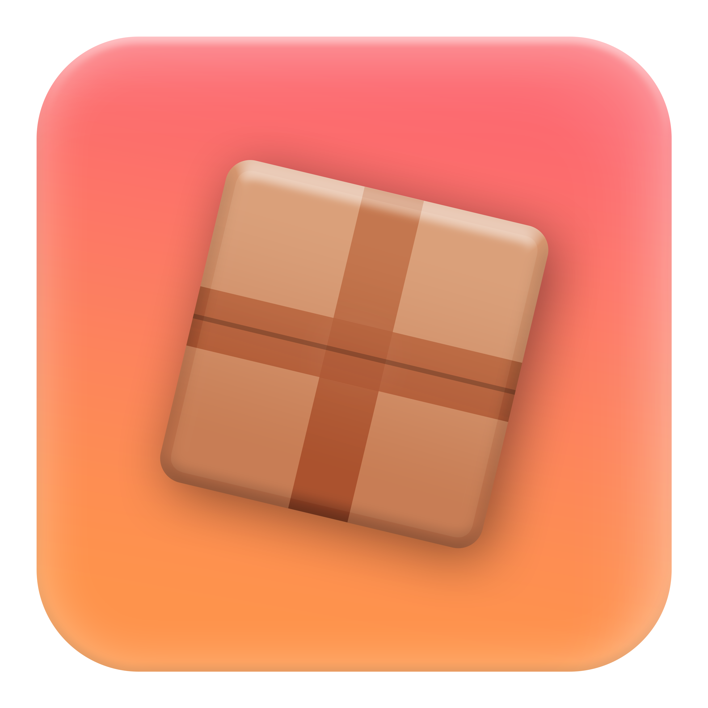

<div align="center">
    <a href="https://github.com/Neohertz/crate"></a>
	
</div>

<h1 align="center">
	Crate
</h1>

<h4 align="center">
    <b>
        A simple to use, scalable state container built for the <a href="https://roblox-ts.com">roblox-ts</a> ecosystem
    </b>
<h4>

<div align="center">

[![Downloads][downloads-shield]][downloads-url]
[![Contributors][contributors-shield]][contributors-url]
[![Stargazers][stars-shield]][stars-url] [![Issues][issues-shield]][issues-url]
[![License][license-shield]][license-url]

</div>

<p align="center">
    <a href="#-notice">Notice</a> •
    <a href="#-installation">Installation</a> •
    <a href="#-react">React</a> •
    <a href="https://docs.neohertz.dev/docs/crate/about">Documentation</a>
</p>

---

# 📛 Notice

> [!CAUTION]
> This package is still in **early beta**, expect breaking changes

# 💻 Installation

To install crate, run one of the following commands in your project's directory.

```bash
npm i @rbxts/crate
yarn add @rbxts/crate
pnpm add @rbxts/crate
```

# ⚛️ React

For more information on using crates with react, see [@rbxts/react-crate](https://github.com/Neohertz/react-crate).

# 💡 Credits

This software uses the following:

-   Emojis were taken from [here](https://emojipedia.org/)

[downloads-shield]: https://img.shields.io/npm/d18m/%40rbxts%2Fcrate?style=for-the-badge
[downloads-url]: https://www.npmjs.com/package/@rbxts/crate
[contributors-shield]: https://img.shields.io/github/contributors/neohertz/crate?style=for-the-badge
[contributors-url]: https://github.com/Neohertz/crate/graphs/contributors
[stars-shield]: https://img.shields.io/github/stars/neohertz/crate?style=for-the-badge
[stars-url]: https://github.com/Neohertz/crate/stargazers
[issues-shield]: https://img.shields.io/github/issues/neohertz/crate?style=for-the-badge
[issues-url]: https://github.com/Neohertz/crate/issues
[license-shield]: https://img.shields.io/github/license/neohertz/crate?style=for-the-badge
[license-url]: https://github.com/Neohertz/crate/blob/master/LICENSE
